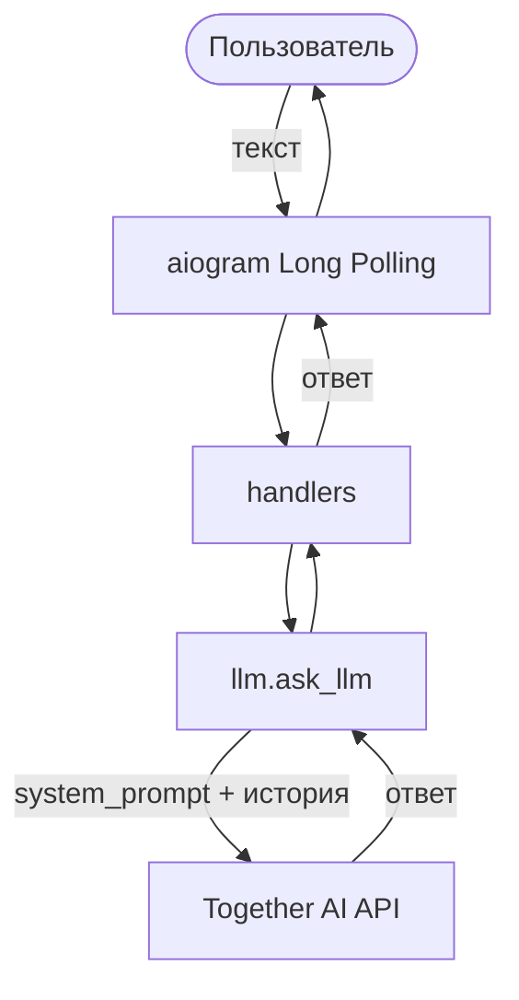
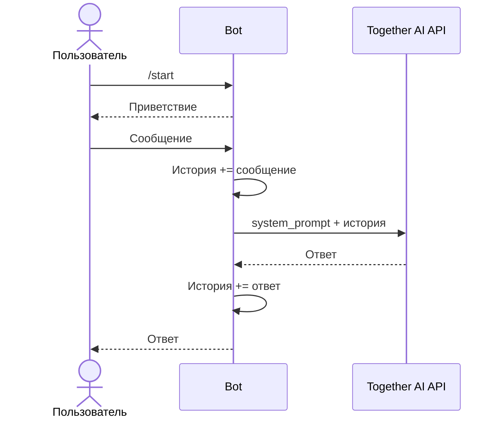

# Техническое видение

Ссылка на описание продукта: [idea.md](idea.md).

---

## 1. Технологии

| Назначение | Технология | Примечание |
|------------|------------|------------|
| Язык | Python 3.11+ | |
| Telegram | aiogram 3.x, Long Polling | ADR-001 |
| LLM | openai SDK | Провайдер: Together AI |
| Конфигурация | pydantic-settings | Чтение из `.env` |
| Зависимости | uv, pyproject.toml | |
| Сборка | Makefile | install, run, lint, format |
| Контейнеризация | Docker | Локально и на сервере |
| Деплой | VPS | Docker, переменные в `.env` |

БД и очереди сообщений не используются.

---

## 2. Принципы разработки

- KISS.
- Функциональный стиль: логика в функциях, без классов.
- Асинхронный I/O (Telegram, LLM) через asyncio.
- Явная логика, без неочевидных абстракций.
- Конфигурация только через `.env`, без значений в коде.

---

## 3. Структура проекта

```
project/
├── bot/
│   ├── handlers.py
│   ├── llm.py
│   └── config.py
├── main.py
├── pyproject.toml
├── Makefile
├── Dockerfile
├── docker-compose.yml
├── .env.example
└── .env
```

`.env` в `.gitignore`.

---

## 4. Архитектура

Обработка сообщения:



История диалога: в памяти процесса, `dict[user_id → list[messages]]`. Один проход: сообщение → LLM → ответ пользователю, без промежуточных слоёв.

---

## 4.1. Последовательность



---

## 5. Модель данных

**История (в памяти, теряется при рестарте):**

- Глобальный словарь: `user_id → list[dict]`.
- Формат сообщения (OpenAI Chat Completions): `{"role": "user"|"assistant"|"system", "content": "..."}`.

**Конфигурация (pydantic-settings из `.env`):**

| Переменная | Описание |
|------------|----------|
| TELEGRAM_TOKEN | Токен бота |
| LLM_API_KEY | Ключ API провайдера |
| LLM_BASE_URL | Базовый URL (Together AI: https://api.together.xyz/v1) |
| MODEL_NAME | Идентификатор модели |
| SYSTEM_PROMPT | Роль/поведение ассистента |
| LOG_LEVEL | Уровень логирования |

Смена провайдера — только правки в `.env` (LLM_BASE_URL, LLM_API_KEY, MODEL_NAME).

---

## 6. Работа с LLM

- Клиент: `openai` SDK с кастомным `base_url` (OpenAI-совместимый API).
- В запрос передаётся: system prompt, полная история диалога, новое сообщение пользователя.
- В `llm.py` одна функция: `ask_llm(history, message) -> str`.
- Стриминг не используется.
- История в запросе не обрезается.

---

## 7. Сценарии

**/start**

1. Ответ приветствием.
2. Инициализация пустой истории для user_id.

**Текстовое сообщение**

1. Добавление сообщения в историю.
2. Вызов LLM (system_prompt + история).
3. Добавление ответа в историю.
4. Отправка ответа пользователю.

---

## 8. Конфигурирование

- Все настройки — из `.env`, загрузка при старте через pydantic-settings.
- В `config.py` — функция `get_settings()`, возвращает объект настроек.
- В репозитории — `.env.example` с перечнем переменных и пустыми значениями.
- Других конфигов (YAML, JSON) нет.

Пример `.env.example`:

```
TELEGRAM_TOKEN=
LLM_API_KEY=
LLM_BASE_URL=https://api.together.xyz/v1
MODEL_NAME=moonshotai/Kimi-K2.5
SYSTEM_PROMPT=You are a helpful assistant.
LOG_LEVEL=INFO
```

---

## 9. Логирование

- Стандартный модуль `logging`.
- Инициализация в `main.py` через `logging.basicConfig()`.
- Уровень из переменной `LOG_LEVEL`.
- События: старт бота, входящее сообщение (user_id, текст), ошибки вызова LLM.
- Формат: `%(asctime)s [%(levelname)s] %(message)s`.
- Вывод в stdout, без файлов.

---

## 10. Сборка и деплой

**Makefile:**

| Команда | Действие |
|---------|----------|
| install | uv sync |
| run | Запуск бота (python) |
| run-docker | docker compose up --build |
| lint | ruff check |
| format | ruff format |

**Docker:** образ на базе `python:3.11-slim`, зависимости через uv. В docker-compose сервис `bot`, подстановка `.env`.

**Локальный запуск:** копировать `.env.example` в `.env`, заполнить переменные, выполнить `make run`.

**Деплой на VPS:** сборка образа по Dockerfile, запуск контейнера на сервере, переменные окружения из `.env` на VPS. Отдельный CI/CD не предусмотрен.
